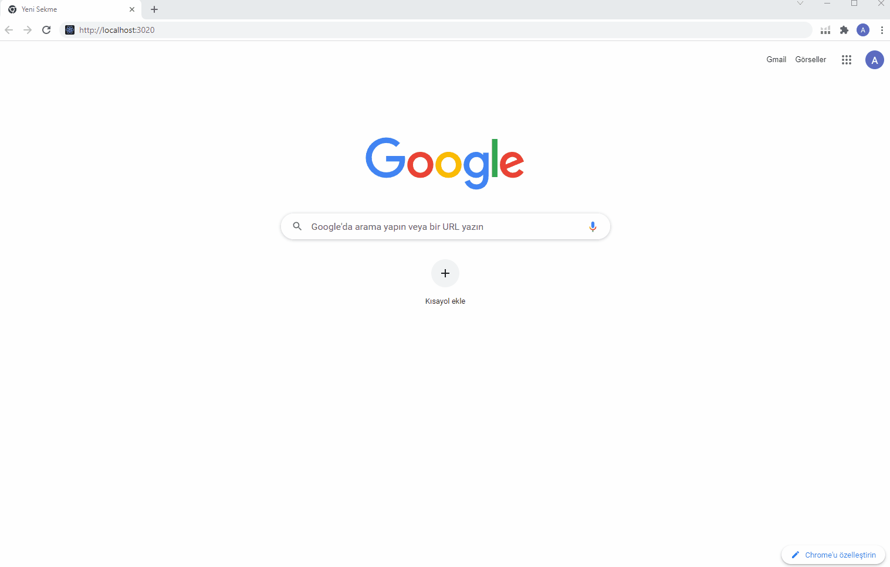
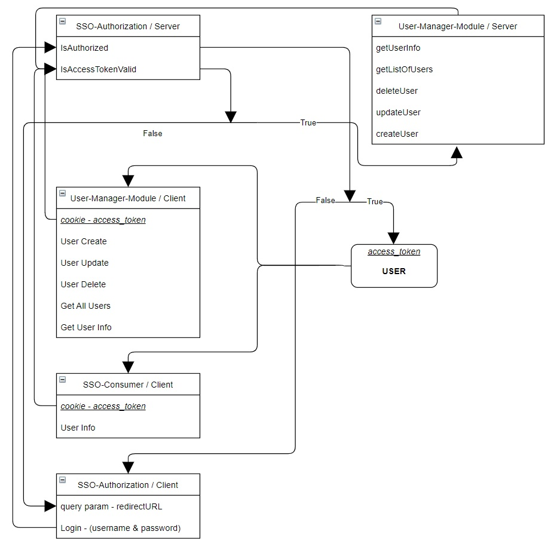

# Simple SSO

### `patika.dev - AloTech FullStack Bootcamp` eğitiminde verilen bitirme projesidir.

<br>

## Proje Katılımcıları

[Oğuz Özşen](https://github.com/OuzOzsn) / [Mustafa Anılcan Yurtbay](https://github.com/yrtby) / [Koray Sarıoğlu](https://github.com/koraysarioglu) / [Ömer Faruk Şahin](https://github.com/omerfaruk-sahin)

<br>

# Example

 


<br>

## Tech Stack
Bu uygulamada backend `Node.js`, frontend `React.JS`, veritabanı `MySQL` kullanılmıştır

* Frontend
    * Teknolojiler
        * React.JS
    * Paketler
        * React-bootstrap – Hazır şablonlar ve responsive uyumluluk.
        * React-cookie – Tarayıcı çerez yönetimi.
        * React-icons – Hazır simgeler.
        * React-toastify – Kullanıcı bildirimi.
        * Formik – Form yönetimi ve doğrulaması.
        * Yup – Form yönetimi ve doğrulaması.
        * Js-sha256 – Giriş bilgilerini backend’e göndermeden önce şifreleme.
        * Axios – HTTP İstemcisi.

* Backend
    * Teknolojiler
        * Node.JS
        * MySQL
    * Paketler
        * Mysql2 – Veritabanı sürücüsü.
        * Sequelize – İlişkisel veritabanı için ORM.
        * Express – Web framework.
        * Cors – Express cors middleware.
        * Bcrypt – Giriş bilgilerini backend’de şifreleme.
        * Axios – HTTP İstemcisi.
        * Morgan – Loglama.
        * Mocha – Unit test çalıştırma.
        * Chai – Unit test oluşturma.
        * Sequelize-test-helpers – Modeller için unit test’e yardımcı paket.

<br>

## Diagram



<br>

## File Structure

```
./
├── sso-authorization
│   └── client
│   │   ├── public
│   │   │── src
│   │   │   └── App.js
│   │   └── .env
│   └── server
│       ├── controller
│       │   └── ssoController.js
│       │── model
│       │   └── index.js
│       │   └── Log.js
│       │   └── Token.js
│       │   └── Url.js
│       │   └── User.js
│       │── route
│       │   └── ssoRoute.js
│       │── test
│       │   └── app.test.js
│       │   └── Log.test.js
│       │   └── Token.test.js
│       │   └── Url.test.js
│       │   └── User.test.js
│       │── app.js
│       └── .env
│
├── sso-consumer
│   └── client
│       ├── public
│       │── src
│       │   ├── components
│       │   │   └── ButtonURL.js
│       │   │   └── Card.js
│       │   └── App.js
│       └── .env
│
├── user-manager-api
│   └── server
│       ├── controller
│       │   └── appController.js
│       ├── middleware
│       │   └── authMiddleware.js
│       │   └── roleMiddleware.js
│       │── model
│       │   └── index.js
│       │   └── Log.js
│       │   └── Token.js
│       │   └── Url.js
│       │   └── User.js
│       │── route
│       │   └── appRoute.js
│       │── test
│       │   └── app.test.js
│       │   └── Log.test.js
│       │   └── Token.test.js
│       │   └── Url.test.js
│       │   └── User.test.js
│       │── app.js
│       └── .env
│
└── user-manager-app
    └── client
        ├── public
        │── src
        │   ├── components
        │   │   └── AddForm.js
        │   │   └── ControlTxt.js
        │   │   └── DeleteForm.js
        │   │   └── EditForm.js
        │   │   └── Header.js
        │   │   └── User.js
        │   │   └── UserList.js
        │   └── App.js
        └── .env
```

<br>
<br>

## Installation

1.  Projeyi klonlayın.
```
$ git clone https://github.com/grup-3-bitirme-odevi/simple-sso
```

2. [Database](https://github.com/grup-3-bitirme-odevi/simple-sso/tree/main/database) klasöründe bulunan `setup.sql` dosyasını import edin. Sonrasında `storedProcedure.txt` dosyasında bulunan stored procedure'leri db nize ekleyin.
Veritabanı işlemlerini yaptıktan sonra demo kullanıcılarınız oluşacaktır. `Admin kullanıcı: admin-123456`, `User kullanıcı: user-123456`

2. Mevcut 5 uygulamada dependency'leri yükleyin.
```
$ ./sso-authorization/client npm install
$ ./sso-authorization/server npm install
$ ./sso-consumer/client npm install
$ ./user-manager-api/server npm install
$ ./user-manager-app/client npm install
```
3. `.env` yapılandırmalarını ayarlayın.
```
################ ./sso-authorization/client/.env ##################
REACT_APP_SSO_SERVER= <http://localhost:3100>
REACT_APP_PASS_SALT= <AloTech>
```
```
################ ./sso-authorization/server/.env ##################
ENV_DB_HOST= <localhost>
ENV_DB_USER= <root>
ENV_DB_PASS= <password>
ENV_DB_NAME= <users>
ENV_DB_DIALECT= <mysql>
ENV_APP_PORT= <3100>
ENV_MODULE_NAME= <SSO-AUTH> // Log tablosuna yazacağı modül ismi
ENV_PASS_SALT= <AloTech>
ENV_TOKEN_TTL= <5> // Dakika
```
```
################ ./sso-consumer/client/.env ##################
REACT_APP_SSO_SERVER= <http://localhost:3100>
REACT_APP_SSO_CLIENT= <http://localhost:3010>
REACT_APP_UMM_SERVER= <http://localhost:3200>
REACT_APP_UMM_CLIENT= <http://localhost:3030>
```
```
################ ./user-manager-api/server/.env ##################
ENV_DB_HOST= <localhost>
ENV_DB_USER= <root>
ENV_DB_PASS= <password>
ENV_DB_NAME= <users>
ENV_DB_DIALECT= <mysql>
ENV_APP_PORT= <3200>
ENV_MODULE_NAME= <USER-MM> // Log tablosuna yazacağı modül ismi
ENV_PASS_SALT= <AloTech>
ENV_SSO_SERVER= <http://localhost:3100>
ENV_SSO_CLIENT= <http://localhost:3010>
ENV_CON_CLIENT= <http://localhost:3020>
ENV_UMM_CLIENT= <http://localhost:3030>
```
```
################ ./user-manager-app/client/.env ##################
REACT_APP_SSO_SERVER= <http://localhost:3100>
REACT_APP_SSO_CLIENT= <http://localhost:3010>
REACT_APP_UMM_SERVER= <http://localhost:3200>
REACT_APP_UMM_CLIENT= <http://localhost:3030>
```
<br>


## RESTFUL Servis

<br>

### SSO-Authorization

<br>

`- isAuthorized`
1. POSTMAN kullanın, Headers'ı `Content-type: application/json` olarak ayarlayın.
2. `http://localhost:3100?redirectURL=http://localhost:3020` via `POST` / `Body -> Raw -> Json`
3. `pass_hash` parametresi sadece `RESTFUL` servis kullanılacak ise `true` olmalı. Sebebi `frontend` kısmında şifrenin `SHA-256` ile şifrelenerek `backend`'e gelmesi. Frontend'de SHA-256 ile şifrelenerek gönderildiğinde `false` olarak gönderilir.

4. `- Request`
```json
{
    "username":"admin",
    "password":"123456",
    "pass_hash":true
}
```

5. `- Response = Success`
```json
{
    "stat": "success",
    "message": "login success",
    "user_id": 1,
    "access_token": "343d9dfc-8845-415a-9fc6-b73547728ee4"
}
```

6. `- Response = Wrong Username`
```json
{
    "stat": "fail",
    "message": "User not found."
}
```

7. `- Response = Wrong Password`
```json
{
    "stat": "fail",
    "message": "Password not match."
}
```

8. `- Response = Wrong URL query`
```json
{
    "stat": "fail",
    "message": "Redirect URL is reqiured."
}
```

9. `- Response = Unauthorized URL`
```json
{
    "stat": "fail",
    "message": "You are not authorized."
}
```

<br>
<br>

`- isAccessTokenValid`
1. POSTMAN kullanın, Headers'ı `Content-type: application/json` ve `Authorization: access_token` olarak ayarlayın.
2. `http://localhost:3100/validate` via `GET`

3. `- Response = Access Token Valid`
```json
{
    "stat": "success"
}
```
4. `- Response = Access Token Invalid`
```json
{
    "stat": "fail",
    "message": "Token not found."
}
```

<br>
<br>

### User-Manager-Module

<br>

`- Create User`
1. POSTMAN kullanın, Headers'ı `Content-type: application/json` ve `Authorization: access_token` olarak ayarlayın.
2. `http://localhost:3200/users` via `POST` / `Body -> Raw -> Json`
3. `pass_hash` parametresi sadece `RESTFUL` servis kullanılacak ise `true` olmalı. Sebebi `frontend` kısmında şifrenin `SHA-256` ile şifrelenerek `backend`'e gelmesi. Frontend'de SHA-256 ile şifrelenerek gönderildiğinde `false` olarak gönderilir.

4. `- Request`
```json
{
    "username":"testuser",
    "user_name":"John",
    "user_surname":"Doe",
    "user_password":"123456",
    "user_email":"testuser@test.com",
    "user_type":"user",
    "pass_hash":true
}
```

4. `- Response = Success`
```json
{
    "stat": "success",
    "message": [
        {
            "id": 7,
            "username": "testuser",
            "user_name": "john",
            "user_surname": "doe",
            "user_password": "$2b$10$DhdDJoFFycuOugpmJ.ebhurnNwH74RiAIcpXwjwkT807B7xvMJdhu",
            "user_email": "testuser@test.com",
            "user_type": "user"
        }
    ]
}
```

4. `- Response = Username Exists`
```json
{
    "stat": "fail",
    "message": "Username exists in the system."
}
```

5. `- Response = Email Exists`
```json
{
    "stat": "fail",
    "message": "Email exists in the system."
}
```

6. `- Response = Check Inputs`
```json
{
    "stat": "fail",
    "message": "All inputs are required."
}
```


<br>
<br>


`- Update User`
1. POSTMAN kullanın, Headers'ı `Content-type: application/json` ve `Authorization: access_token` olarak ayarlayın.
2. `http://localhost:3200/users/{user_id}` via `PUT` / `Body -> Raw -> Json`
3. `pass_hash` parametresi sadece `RESTFUL` servis kullanılacak ise `true` olmalı. Sebebi `frontend` kısmında şifrenin `SHA-256` ile şifrelenerek `backend`'e gelmesi. Frontend'de SHA-256 ile şifrelenerek gönderildiğinde `false` olarak gönderilir.

4. `- Request`
```json
{
    "username": "testuserUpdate",
    "user_name": "Johnn",
    "user_surname": "Doeee",
    "user_password": "", // Şifreyi boş bırakırsanız, şifre güncellenmez.
    "user_email": "testuserUpdate@mail.com",
    "user_type": "user",
    "pass_hash": true
}
```

5. `- Response = Success`
```json
{
    "stat": "success",
    "message": {
        "username": "testuserUpdate",
        "user_name": "Johnn",
        "user_surname": "Doeee",
        "user_email": "testuserUpdate@mail.com",
        "user_type": "user"
    }
}
```

6. `- Response = Wrong User`
```json
{
    "stat": "fail",
    "message": "User not found."
}
```

7. `- Response = Check Inputs`
```json
{
    "stat": "fail",
    "message": "All inputs are required."
}
```

<br>
<br>

`- Delete User`
1. POSTMAN kullanın, Headers'ı `Content-type: application/json` ve `Authorization: access_token` olarak ayarlayın.
2. `http://localhost:3200/users/{user_id}` via `DELETE`

4. `- Response = Success`
```json
{
    "stat": "success",
    "message": "User deleted."
}
```

4. `- Response = Wrong User`
```json
{
    "stat": "fail",
    "message": "User not found."
}
```

<br>
<br>

`- Get All Users`
1. POSTMAN kullanın, Headers'ı `Content-type: application/json` ve `Authorization: access_token` olarak ayarlayın.
2. `http://localhost:3200/users` via `GET`

3. `- Response = Success`
```json
{
    "stat": "success",
    "data": [
        {
            "id": 1,
            "username": "admin",
            "user_name": "Admin",
            "user_surname": "Doe",
            "user_email": "admin@email.com",
            "user_type": "admin"
        },
        {
            "id": 2,
            "username": "user",
            "user_name": "John",
            "user_surname": "Doe",
            "user_email": "admin@email.com",
            "user_type": "admin"
        },
        {
            "id": 3,
            "username": "test",
            "user_name": "Test",
            "user_surname": "Doe",
            "user_email": "test@mail.com",
            "user_type": "user"
        }
    ]
}
```

<br>
<br>

`- Get User Info`
1. POSTMAN kullanın, Headers'ı `Content-type: application/json` ve `Authorization: access_token` olarak ayarlayın.
2. `http://localhost:3200/users/info` via `GET`

3. `- Response = Success`
```json
{
    "stat": "success",
    "data": {
        "id": 1,
        "username": "admin",
        "user_name": "Admin",
        "user_surname": "Doe",
        "user_email": "admin@email.com",
        "user_type": "admin"
    }
}
```
